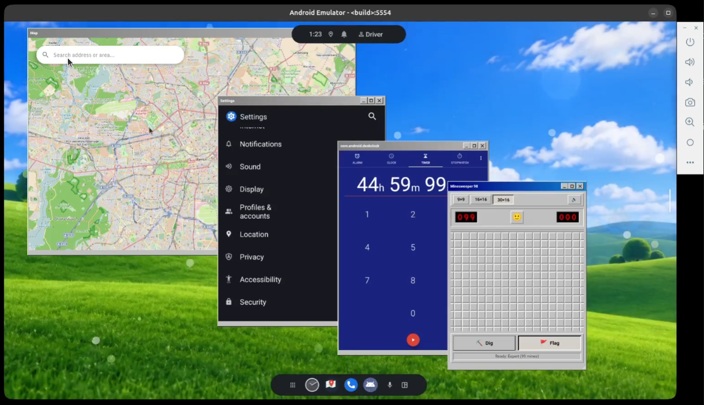

# CarSystemUI Win98

Windows 98 window chrome for Scalable UI on Android Automotive. Any app launches into its
own window with a caption, a 3-D frame and a resize bar; product panels can be decorated the
same way. Windows drag, resize, minimize to a taskbar chip, maximize and close.

Built as a **pod**: an `android_library` wired into `CarSystemUI` through Dagger. It uses only
Scalable UI's public controller surface: no reflection, no changes to `car-scalable-ui-lib` or
`car-wm-shell-lib`.



## What it does

| Gesture | What happens |
|---|---|
| launch an app | it opens in the next free window of the pool, cascaded, in front |
| drag the caption | task and chrome move together at the same size (surface-only); on release WindowManager gets one bounds change |
| resize (frame / bottom bar / corner) | a dashed shim follows the finger; the task is resized once, on release |
| `_` minimize | the window hides, the task keeps running, a chip appears on the bottom edge; tap the chip to restore |
| `□` maximize | the window fills the work area (display minus system bars); the button turns into restore |
| `X` close | the window hides, no chip; it reappears when an app opens in it again |
| tap inside an app / on the caption | the window comes to the front, its caption turns blue |

Nothing is killed. Close is a hide: the task stays alive in its root task stack.

## Tested on

| | |
|---|---|
| AOSP | `aosp-17_r1`, Android 17 (SDK 37), build `CP2A.260605.016` |
| Lunch target | `sdk_car_dewd_x86_64-userdebug` |
| Emulator | `emulator_car64_x86_64`, 2560×1440 @ 140 dpi (also 1920×1080) |
| Flag | `enable_ext_panel_updates` on (it is in the DEWD targets) |

### Which emulator to build

Use the **DEWD** car target: `sdk_car_dewd_x86_64`. DEWD ("declarative windowing definition")
is the AOSP product that ships Scalable UI switched on with the `enable_ext_panel_updates`
flag; the plain `sdk_car_x86_64` target does not enable it and the pod cannot follow its
panels there.

```
source build/envsetup.sh
lunch sdk_car_dewd_x86_64-userdebug
m
emulator -gpu host -cores 3 -memory 6096 -no-snapshot-save -writable-system -skin 2560x1440
```

`-skin` is optional; the pod works at any resolution. `-writable-system` lets you `adb sync`
a rebuilt `CarSystemUI` without reflashing.

## Requirements

- `aosp-17_r1`. The pod uses `DecorPanelControllerBase`, `PanelUpdateConsumer`,
  `EventDispatcher`, `StateManager`, `AutoSurfaceTransaction` and `AutoTaskStackTransaction`
  as they are in that release.
- `enable_ext_panel_updates` on. Without it `PanelUpdateConsumer` is absent and the bar cannot
  follow its panel.
- `CarSystemUI-Shared` buildable in your tree; the pod's only static dependency.

## Install

Five edits in `packages/apps/Car/SystemUI`, then `m CarSystemUI`.

1. Clone into the pods directory:

   ```
   git clone https://github.com/passenger6/car-systemui-win98-pod.git \
       packages/apps/Car/SystemUI/pods/win98
   ```

2. Register the library in `Android.bp`:

   ```diff
    carsysui_pods = [
   +    "CarSystemUI-Win98",
   ```

3. Include the Dagger module in
   `src/com/android/systemui/car/wm/scalableui/panel/controller/PanelControllerModule.java`:

   ```diff
   +import com.android.systemui.car.win98.Win98PanelModule;

   -@Module(includes = { MinimizedControlsPanelModule.class })
   +@Module(includes = { MinimizedControlsPanelModule.class, Win98PanelModule.class })
   ```

4. Expose the window pool on the WM component,
   `src/com/android/systemui/wmshell/CarWMComponent.java`:

   ```diff
   +import com.android.systemui.car.win98.Win98WindowPool;

        // ...
   +    /** The blank windows apps are launched into. Nothing injects it; this getter builds it. */
   +    @WMSingleton
   +    Win98WindowPool getWin98WindowPool();
   ```

5. Build it at startup, `src/com/android/systemui/CarSystemUIInitializer.java`, inside
   `initWmComponents`:

   ```diff
   +    carWm.getWin98WindowPool();
   ```

   Steps 4 and 5 exist because the pool registers its panels from its own constructor and
   nothing else depends on it; Dagger only constructs what is asked for.

If you only want to decorate product panels and do not want the pool, skip steps 4 and 5.


## Decorate a product panel

One `DecorPanel` per window, pointing at the target with `<OverlayPanelId>`. The bar's own
bounds in XML are only a starting point; the controller wraps it around the task as soon as
the target reports its bounds. Its `Layer` should be **one below** the target so the task
covers the client hole and keeps its touches; the controller enforces this at runtime.

```xml
<!-- res/xml/win98_maps_panel.xml -->
<DecorPanel id="win98_maps_panel" defaultVariant="@id/open" displayId="0"
            controller="@xml/win98_maps_panel_controller">
    <Variant id="@+id/base">
        <Layer layer="2"/>                              <!-- target's layer − 1 -->
    </Variant>
    <Variant id="@+id/open" parent="@id/base">
        <Visibility isVisible="true"/>
        <Bounds left="0%" top="0%" right="100%" height="42dp"/>
    </Variant>
</DecorPanel>

<!-- res/xml/win98_maps_panel_controller.xml -->
<Controller id="win98_maps_panel_controller">
    <ControllerName>com.android.systemui.car.win98.Win98TitleBarController</ControllerName>
    <View>com.android.systemui.car.win98.Win98TitleBarView</View>
    <OverlayPanelId>maps_panel</OverlayPanelId>
</Controller>
```

Add `@xml/win98_maps_panel` to the `window_states` array in the RRO's
`res/values/config.xml`.

### Teach the target panel the window states

The controller only *fires events* for minimize, close, maximize and restore; the target's
XML decides what they mean. Free placement is **not** declared in XML: on the first drop the
controller installs two runtime variants (`win98_free_a` / `win98_free_b`) and transitions on
`_Win98_<panel>_Drop_a` / `_Drop_b`.

```xml
<TaskPanel id="maps_panel" ...>
    ...
    <!-- Two hidden variants, not one: the bar reads "minimized or closed?" off the variant
         NAME. A minimized window keeps a taskbar chip; a closed one does not. -->
    <Variant id="@+id/win98_minimized" parent="@id/open">
        <Visibility isVisible="false"/>
    </Variant>
    <Variant id="@+id/win98_hidden" parent="@id/open">
        <Visibility isVisible="false"/>
    </Variant>
    <Variant id="@+id/win98_fullscreen" parent="@id/open">
        <Bounds left="0%" top="42dp" right="100%" bottom="100%"/>
    </Variant>

    <Transitions>
        <Transition toVariant="@id/win98_minimized"  onEvent="_Win98_maps_panel_Minimize"/>
        <Transition toVariant="@id/win98_hidden"     onEvent="_Win98_maps_panel_Close"/>
        <Transition toVariant="@id/open"             onEvent="_Win98_maps_panel_Restore"/>
        <Transition toVariant="@id/win98_fullscreen" onEvent="_Win98_maps_panel_Fullscreen"/>
        <!-- a hidden window comes back when an app opens in it -->
        <Transition fromVariant="@id/win98_hidden" toVariant="@id/open"
                    onEvent="_System_TaskOpenEvent" onEventTokens="panelId=maps_panel"/>
        <Transition fromVariant="@id/win98_minimized" toVariant="@id/open"
                    onEvent="_System_TaskOpenEvent" onEventTokens="panelId=maps_panel"/>
    </Transitions>
</TaskPanel>
```

Event ids are `_Win98_<targetPanelId>_<Minimize|Close|Restore|Fullscreen|Drop_a|Drop_b>`.
The pool's windows get all of this at registration; only product panels need the XML.

## Configure

Every resource below is overridable by an RRO targeting `com.android.systemui`.

| Resource | Default | Meaning |
|---|---|---|
| `array/win98_stay_back_panels` | empty | panel ids that never take focus or come to the front on a click: a full-screen map used as the backdrop |
| `array/win98_always_on_top_panels` | empty | panel ids the windows are never raised over: an app grid, a notification shade |
| `integer/win98_always_on_top_layer` | 0 (no ceiling) | the lowest layer any always-on-top panel uses; windows stay below it. Set it together with the array above |
| `dimen/win98_title_bar_height` | 42dp | keep a product panel's fullscreen `top` in sync |
| `dimen/win98_chip_width` / `_height` / `_margin` / `_gap` | 180 / 42 / 8 / 6 dp | taskbar chips |
| `dimen/win98_chip_inset_left` | 0dp | set to a left navigation bar's width so chips stay clear of it |
| `dimen/win98_button_width` / `_height` / `_gap` | 32 / 28 / 3 dp | caption buttons |
| `dimen/win98_glyph_size` | 14dp | the icon inside a caption button |
| `dimen/win98_frame_width` / `win98_resize_bar_height` / `win98_resize_corner` | 4 / 24 / 28 dp | frame, resize bar, corner hit target |
| `dimen/win98_min_client` | 120dp | smallest task size a resize will accept |
| `color/win98_title_active_start` / `_end` | `#000080` → `#1084D0` | active caption gradient |
| `color/win98_title_inactive_start` / `_end` | `#808080` → `#B5B5B5` | inactive caption gradient |
| `color/win98_face` / `_light` / `_shadow` / `_dark_shadow` / `_glyph` | the Windows 98 grey scheme | bevels and icons |
| `drawable/win98_glyph_minimize` / `_maximize` / `_restore` / `_close` | vectors | caption button icons |
| `drawable/win98_bevel_raised` / `_sunken` / `win98_button_background` | layer-lists | caption button bevel, at rest and pressed |

Layers: windows occupy `[20, 20 + 2 × window count)`, two per window (task, chrome one below).
Product panels that should sit under the windows use layers below 20; panels that should stay
above them go in `win98_always_on_top_panels` with a layer at or above
`win98_always_on_top_layer`.


## Known limits

- Caption buttons respond to touch only; they are not reachable with the rotary controller.
- A shell transition started by something else mid-drag re-applies the target's variant bounds
  for one frame; the next MOVE puts the window back under the finger.
- One chrome per panel. Fullscreen drops the frame and resize bar, leaving the caption.
- CTS has not been run against this. A desktop metaphor touches window visibility, focus, insets
  and task lifecycle; whether a product using it stays compliant is a question for that
  product's test runs.

## License
